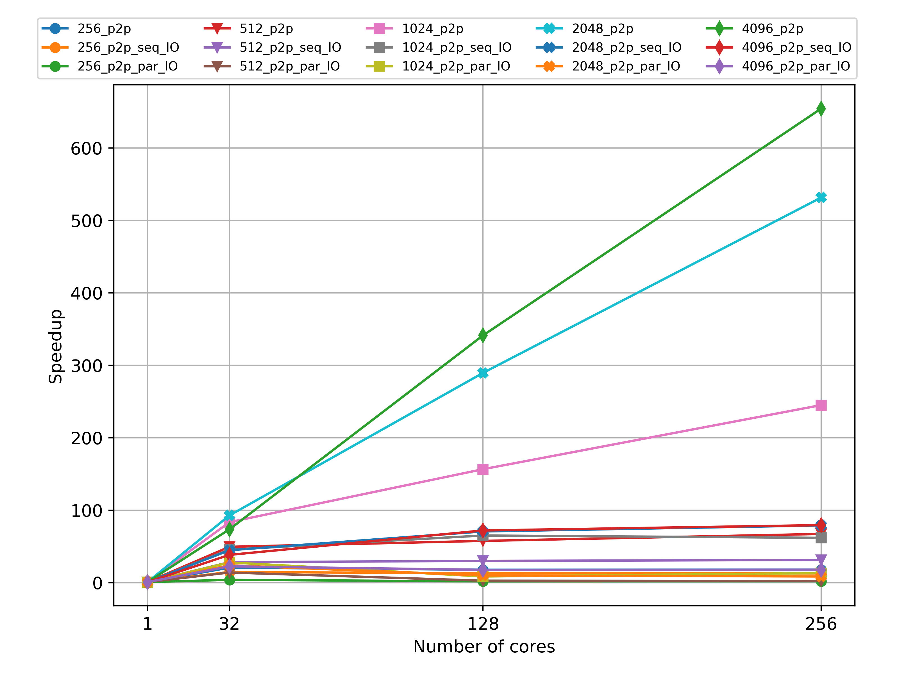
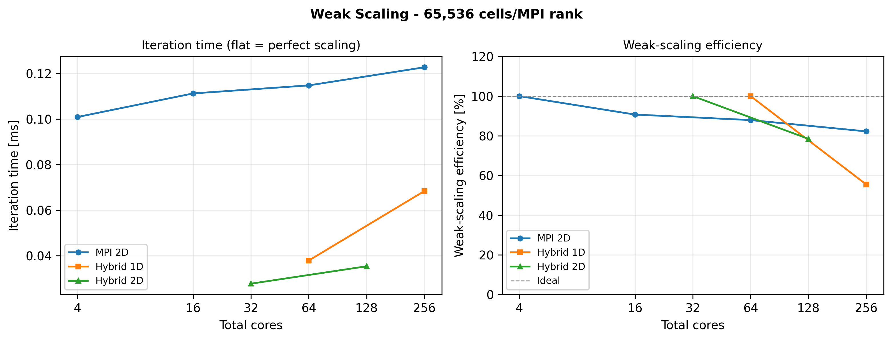
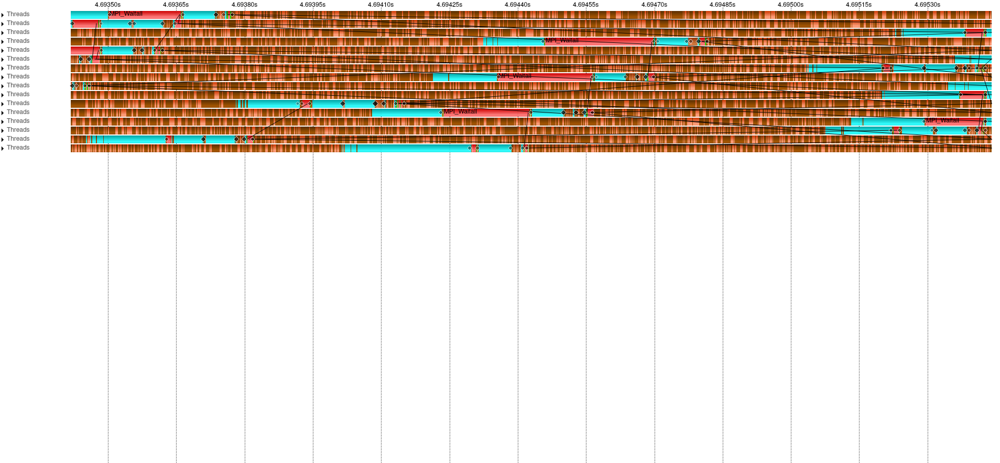

# Parallel Heat Solver

MPI/OpenMP heat-diffusion solver for a 2D grid. The project compares domain
decomposition strategies, halo-exchange implementations and HDF5 output paths on
a multi-node HPC cluster.

Live artefacts:

- Presentation: <https://theramsay.github.io/ppp-project/presentation/>
- Performance dashboard: <https://theramsay.github.io/ppp-dashboard/>

## What This Implements

- 2D explicit stencil solver with double-buffered temperature fields.
- 1D and 2D Cartesian MPI decompositions.
- Non-blocking P2P halo exchange with overlap between communication and inner-tile computation.
- RMA halo exchange optimized from a naive `MPI_Get`/`MPI_Win_fence` version to
  `MPI_Put` with packed contiguous buffers and PSCW synchronization over neighbor groups.
- Parallel HDF5 output using hyperslabs and collective `H5Dwrite`.
- Benchmark scripts for strong scaling, weak scaling and Score-P/Vampir/Cube profiling.

## Results Snapshot

The best measured configuration was the hybrid MPI+OpenMP solver with 2D
decomposition and P2P halo exchange on a `4096^2` grid.

| Variant | Best reported configuration | Result |
| --- | --- | --- |
| Hybrid 2D P2P | 32 MPI ranks x 8 OpenMP threads | approx. 666x speedup |
| Pure MPI 2D P2P | 128 MPI ranks | approx. 354x speedup |
| Hybrid 1D P2P | 16 MPI ranks x 16 OpenMP threads | approx. 407x speedup |

The main performance conclusion is that 2D decomposition reduces halo traffic.
For a square `N x N` domain and `P` MPI ranks, the communicated halo volume ratio
is approximately:

```text
V_1D / V_2D = sqrt(P) / 2
```

At larger process counts this makes the 1D stripe decomposition increasingly
communication-heavy.

## Figures

Strong scaling, hybrid 2D P2P:



Weak scaling summary:



Score-P/Vampir trace of one P2P iteration:



## Repository Layout

```text
sources/              Solver, data generator and HDF5 utilities
scripts/              Cluster benchmark and plotting scripts
docs/figures/         Selected benchmark and profiling figures
docs/presentation/    Reveal.js presentation published with GitHub Pages
3rdparty/             Vendored cxxopts, fmt and stb headers
```

The `dev` branch keeps raw experiments, draft notes and archived benchmark
outputs. The `main` branch is intentionally trimmed to the final implementation,
selected figures and public documentation.

## Build

Requirements:

- CMake 3.22+
- C++17 compiler
- MPI
- OpenMP
- HDF5 with C and HL components, preferably a parallel HDF5 build

```bash
cmake -S . -B build -DCMAKE_BUILD_TYPE=Release
cmake --build build -j
```

This builds:

- `build/ppp_proj01` - heat solver
- `build/data_generator` - synthetic HDF5 input generator

## Minimal Run

Generate a small input and run the sequential solver:

```bash
./build/data_generator -n 256 -o input_256.h5
./build/ppp_proj01 -n 100 -m 0 -w 10 -i input_256.h5 -o output.h5
```

Run the MPI solver with 2D decomposition and P2P halo exchange:

```bash
mpirun -np 4 ./build/ppp_proj01 -b -g -n 100 -m 1 -w 50 -i input_256.h5
```

Modes:

- `-m 0` sequential
- `-m 1` MPI P2P halo exchange
- `-m 2` MPI RMA halo exchange
- `-g` enables 2D decomposition; without it the solver uses 1D decomposition
- `-p` enables parallel HDF5 output
- `-t <N>` sets OpenMP threads per MPI rank

## Notes

The benchmark scripts are cluster-oriented and expect SLURM, Lustre and input
datasets named `input_data_<size>.h5`. Replace `YOUR_PROJECT_ACCOUNT` and set
`PPP_PROJECT_ID` before submitting them on a different system.
